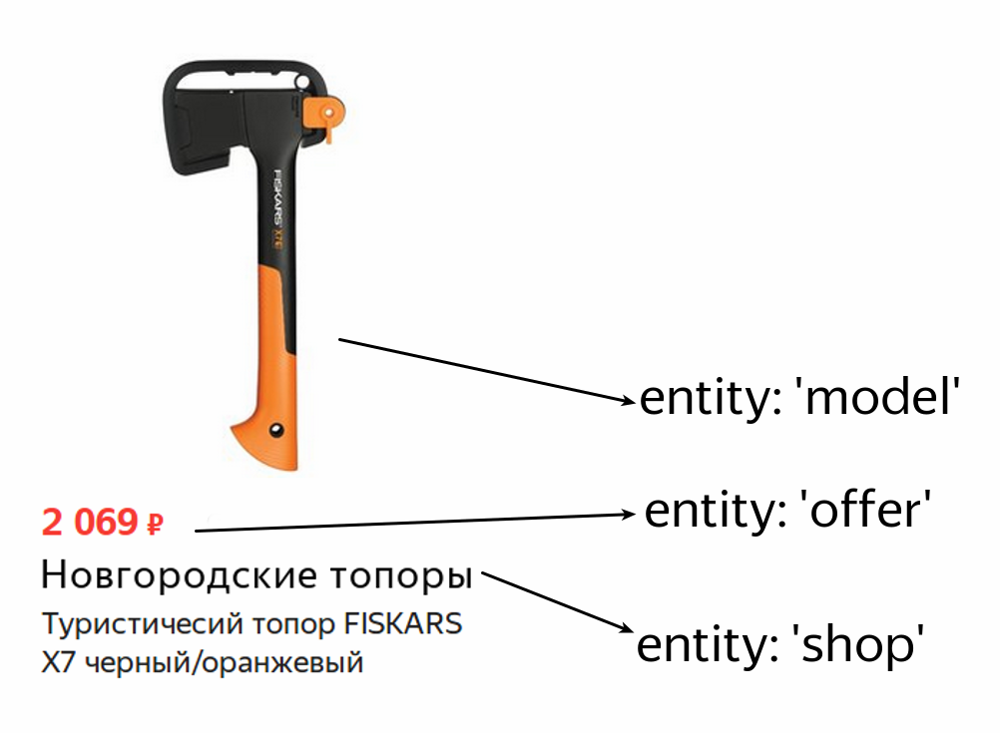
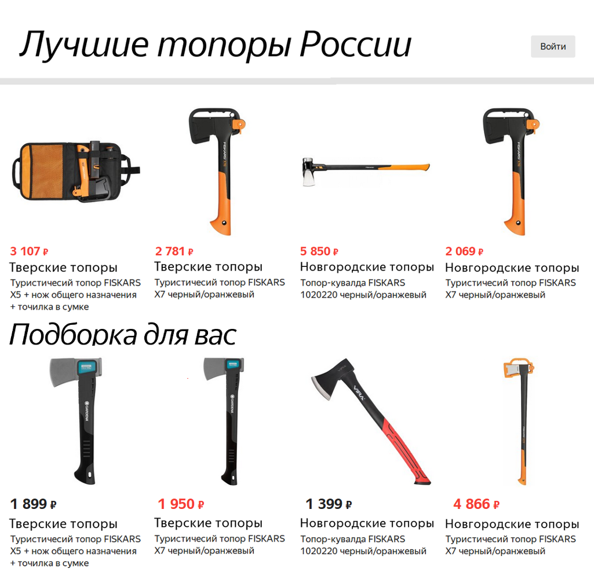
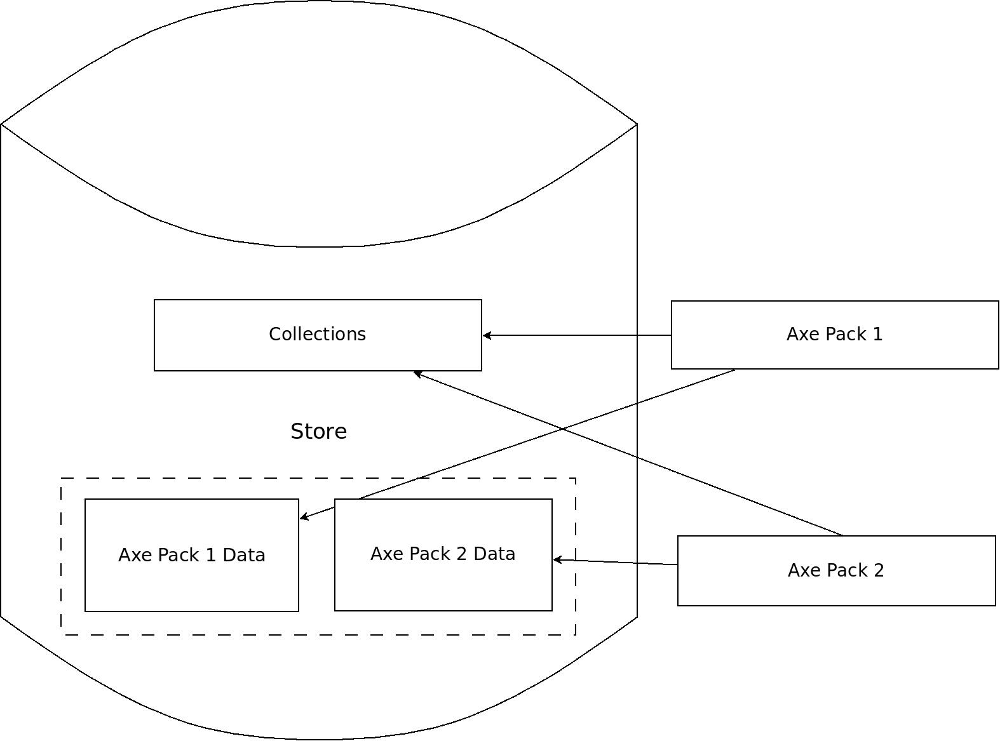

---

layout: default

style: |
    .slide code {
        font-size: 30px !important;
        line-height: 40px !important;
    }

    .my-right-image {
        position: absolute;
        width: 1200px;
        top: 0;
        left: 824px;
    }

    .slide h2 {
        margin-bottom: 15px !important;
    }

    .slide pre {
        margin-top: 15px !important;
    }

---

# {:.logo}

## {{ site.presentation.title }}
{:.title}

### {{ site.presentation.service }}

<div class="authors">

<p>{{ site.author.name }}, {{ site.author.position }}</p>



<p>{{ site.author2.name }}, {{ site.author2.position }}</p>


</div>

## О чем поговорим?

1. Зачем нужны бизнес-сущности
2. Как мы работали со стейтом раньше
3. Подход в стиле redux
4. Наш подход с виджетами в Маркете

## Вводная
{:.section}

## Продаем топоры

У нас есть топоры разных моделей, цен и несколько партнеров-поставщиков

## 

## Back to 2000

Как бы мы это сделали в середине прошлого десятилетия?

1. Какой-нибудь декларативный шаблонизатор (f.g. XSLT)
2. Древовидный формат данных

## Представим «стейт»

или то, что мы отдаем шаблонизатору для первоначального рендеринга

```js
[{
    title: 'Axe 2000',
    offers: [{
        price: 500,
        shop: {
            title: 'Тверские топоры'
        }
    }, {
        price: 200,
        shop: {
            title: 'Новгородские топоры'
        }
    }]
}];
```

## Этого достаточно, чтобы отрисовать страницу

Но тут есть проблемы:

1. Они не переиспользуются, их структура ничем не гарантируется
2. К такому коду нельзя написать надежный селектор
3. Эти данные описывают макет, а не предметную область
4. С новым макетом или страницей придется изобретать новый формат

## Проектируем нормально

**О чем следовало подумать в первую очередь?**

1. Какие сущности могут описать предметную область?
2. Как описать связи между этими сущностями?
3. Как их хранить и как с ними работать?

## Выделим сущности

1. Модель топора (model)
2. Конкретное предложение (offer)
3. Магазин-партнер (shop)


{:.my-right-image}

## Пометим сущности полем entity
{:.big-code}

~~~ javascript
[{
    title: 'Axe 2000',
    entity: 'model',
    offers: [{
        entity: 'offer',
        price: 500,
        shop: {
            entity: 'shop',
            id: "tverShop",
            title: 'Тверские топоры'
        }
    }, {
        entity: 'offer',
        price: 200,
        shop: {
            entity: 'shop',
            id: "novgShop",
            title: 'Новгородские топоры'
        }
    }]
}];
~~~

## Почему стало лучшие?

1. Работая с бизнес-сущностями, мы можем поддерживать контракт
2. Сущности остаются прежними вне зависимости от макета
3. Легко и понятно, как написать селекторы, на что завязаться

## View data vs entities


## Однако есть и другие проблемы

1. Дублирование данных
2. Нет единого источника истины
3. Такие данные сложно изменять

## Пример с дублированием данных

~~~ javascript
[{
    title: 'Axe 2000',
    entity: 'model',
    offers: [{
        entity: 'offer',
        price: 500,
        shop: {
            entity: 'shop',
            id: "tverShop",
            title: 'Тверские топоры'
        }
    }, {
        entity: 'offer',
        price: 200,
        shop: {
            entity: 'shop',
            id: "tverShop",
            title: 'Тверские топоры'
        }
    }]
}];
~~~

## Наше время
{:.section}

## Redux и normalizr во фронтенде

Что это значит?

1. Redux подталкивает нас к нормализации
2. Нет дублирования в рамках одного стора
3. Возможно сделать единый источник истины для всего приложения

## А что такое normalizr?

Небольшая библиотека для конвертации вложенных данных в нормализованные на основе описанной схемы

https://github.com/paularmstrong/normalizr


## Пример нормализованных данных

~~~ javascript
{
    items: [{
        entity: 'offer',
        id: 1
    }],
    entities: {
        offer: {
            "1": {
                entity: 'offer',
                price: 500,
                shop: "tverShop",
            },
        },
        shop: {
           "tverShop": {
                entity: 'shop',
                title: "Тверские топоры"
            },
        },
    },
}
~~~

## Итого

* Наши данные нормализованы и дедуплецированы
* Есть единый источник истины (redux store)
* Исходя из предыдущих пунктов, эти двнные удобно модифицировать

## Усложним задачу
{:.section}

## Теперь менеджеры магазина хотят:

* Размещать произвольное количество наборов топоров в любой последовательности
* Если возникает ошибка в одном из наборов, остальные подгружаются как есть
* Первые наборы топоров должны показываться сразу, не ожидая прогрузки всех остальных

## 
{: .slide .cover .w  .center }

## Что это значит с точки зрения разработки?

* Каждый набор топоров запрашивает данные у бекенда отдельно
* Для переиспользования логика получения данных инкапсулирована в компоненте
* Не смотря на две особенности выше, нужно как-то дедуплецировать данные между наборами

... **Другими словами, набор топоров становится виджетом**

## Что такое виджеты?

Это независимая часть приложения, которая:

* сама знает, как получить и отрисовать данные
* не влияет на другие виджеты
* является error-boundary (границой ошибок)
* работает полностью независимо от других виджетов.

## Звучит здорово, однако...

... как же дедупликация данных?

... как обеспечить независимость виджетов в store?

## Наше решение
{:.section}

## Два пункта

1. Разделение данных на данные виджета и коллекции
2. Своя версия connect

## Коллекции

1. Неупорядоченное хранилище сущностей по ключу
2. Доступно всем виджетам сразу

```js
{
    collections: {
	    offer: {
            1: {id: "1", price: 500, shop: "tverShop"},
            2: {id: "2", price: 233, shop: "tverShop"},
            3: {id: "3", price: 600, shop: "tverShop"},
            4: {id: "4", price: 350, shop: "tverShop"},
        },
        shops: {"tverShop": {title: 'Новгородские топоры'}}
	}
}
```

## Данные виджета

1. Ключи для коллекций с сохранением нужного порядка
2. Данные, которые не являются сущностями и принадлежат именно этому виджету

```js
{
	widgets: {
	    "axesPack1": {
	        offerIds: [1, 2, 3],
	    },
        "axesPack2": {
            offerIds: [2, 3, 4],
	    },
	},
}
```

## Соберем все вместе
{:.fullscreen}

```js
{
    collections: {
	    offer: {
            1: {id: "1", price: 500, shop: "tverShop"},
            2: {id: "2", price: 233, shop: "tverShop"},
            3: {id: "3", price: 600, shop: "tverShop"},
            4: {id: "4", price: 350, shop: "tverShop"},
        },
        shops: {"tverShop": {title: 'Новгородские топоры'}}
	}
	widgets: {
	    "axesPack1": {
	        offerIds: [1, 2, 3],
            title: 'Топоры по лучшим ценам',
	    },
        "axesPack2": {
            offerIds: [2, 3, 4],
            title: 'Топоры специально для вас',
	    },
	},
}
```

## Connect

Чтобы гарантировать принцип независимости, используем свою обертку над connect

1. Ограничивает mapStateToProps коллекциями и данными виджета
2. В остальном работает точно так же, как и обычный connect

```js
function mapStateToProps(widgetData, collections) {
    // Берем id нужных нам топоров
    const {offerIds} = widgetData;

    return {
        // Для каждого id получаем сущность из коллекции
        axes: offerIds.map(id => collections.offer[id]),
    };
}
```

## Если визуализировать
## 

## Хорошо, а что подгрузкой данных?

1. Виджеты сами знают, как сделать запрос за дополнительными данными
2. Виджеты сами могут обновить коллекции (это просто редюсер)

## Подведем итог

1. Всегда следует не адаптировать данные под макеты, а описывать бизнес-сущности
2. Redux позволяет дедуплецировать и легко обновлять данные
3. На его основе можно удобно сконструировать свою виджетную систему

## PS

Детальный рассказ про нашу виджетную систему от Паши Павелко:

<a href="http://www.highload.ru/siberia/2018/abstracts/3682">http://www.highload.ru/siberia/2018/abstracts/3682</a>

## Контакты 
{:.contacts}



<figure markdown="1">

### {{ site.author.name }}


{{ site.author.position }}


</figure>





<figure markdown="1">

### {{ site.author2.name }}


{{ site.author2.position }}


</figure>



<!-- разделитель контактов -->
-------

<!-- left -->
- {:.telegram}imalyavin
- {:.mail}ilya.m32@yandex.ru

<!-- 

- {:.mail}author@yandex-team.ru
- {:.phone}+7-999-888-7766
- {:.github}author
- {:.bitbucket}author
- {:.twitter}@author
- {:.telegram}author
- {:.skype}author
- {:.instagram}author
- {:.facebook}author
- {:.vk}@author
- {:.ok}@author

-->
